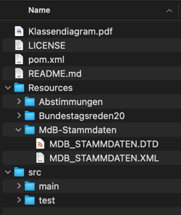

# PPR Übung 2

Dieses Projekt implementiert Übung 2 des PPR 2023/24 (Das Projekt hat entweder den
Namen [InsightBundestag](https://github.com/texttechnologylab/InsightBundestag#insightbundestag)
oder [Inside Bundestag](https://github.com/texttechnologylab/InsightBundestag/blob/1bef679a79fabc9686b0bfeccd9475cf95ef441b/src/main/java/org/texttechnologylab/project/data/BundestagObject.java#L4),
was zwei unterschiedliche Dinge wären, aber die Übungsleitung scheint sich da nicht ganz sicher zu sein).

## Aufgabe 1

Die Klassenstruktur des Projekts ist im UML-Diagramm in der Datei [Klassendiagramm.png](Klassendiagramm.png) zu finden.
Aufgrund der Größe des Diagramms lässt sich dieses nicht sinnvoll in die README.md selbst einbinden.

## Aufgabe 2

Die Klassen sind im Package `org.texttechnologylab.project.Stud1.Uebung2` implementiert.
Dabei sind die Impl-Klassen sowie die öffentlichen Interfaces in `data`.
Die Implementierung stellt sicher, dass alle `Impl`-Klassen abgekapselt sind und nicht von außerhalb darauf direkt
zugegriffen werden kann.
Sie können nur durch die `BundestagFactory` erstellt werden.

Auch die `BundestagFactoryImpl` ist abgekapselt.
Sie kann nur durch `BundestagFactory::newInstance` erstellt werden.

Die `BundestagFactory` kann Dateien einlesen.
Dies geschieht über die Methoden `readStammdaten`, `readProtokoll` und `readAbstimmungXls[x]`.
Diese nehmen jeweils eine Datei an.
Beim Einlesen bildet die `BundestagFactory` die Daten der Datei auf die entsprechenden Implementierungen ab und
speichert diese.
Über die definierten Methoden kann darauf dann zugegriffen werden.

### Dateien

Die Dateien sind im `Resources`-Ordner im Projekt abzulegen.
Falls der Ordner nicht existiert, sollte er erstellt werden.
Die Struktur des Projekts soll dann wie folgt aussehen (Inhalt der Bundestagsreden20- und Abstimmungen-Ordner analog,
die Strukur entspricht der Dateien in Olat):

### Tests

In `org.texttechnologylab.project.Stud1.Uebung2.tests.BundestagFactoryTest` sind Unit-Tests implementiert,
die darauf achten, dass die Anwendung die Stammdatendatei korrekt liest und dass die richtigen Exceptions geworfen
werden, wenn Reden oder Abstimmungen vor Stammdaten eingelesen werden.

### Dokumentation

Alle Klassen und Methoden sind mit JavaDoc dokumentiert.
Die generierte Dokumentation kann im `JavaDoc`-Ordner gefunden werden (nur im OLAT-Upload).

## Aufgabe 3

Die Abfragen sind wie in der Aufgabenstellung gefordert (for some reason...) als Unit-Tests implementiert.
Da die Konsole teilweise zu wenige Zeilen hat, werden zusätzlich zur Konsolenausgabe automatisch die Ergebnis-Dateien
erstellt.
Diese lassen sich im `Antworten`-Ordner im Projekt finden (dieser wird erstellt, wenn er noch nicht existiert).

Die produzierten Antworten lassen sich sonst einfach durch Ausführen der "Tests"
in `org.texttechnologylab.project.Stud1.Uebung2.tests` im `src/test`-Ordner generieren.
