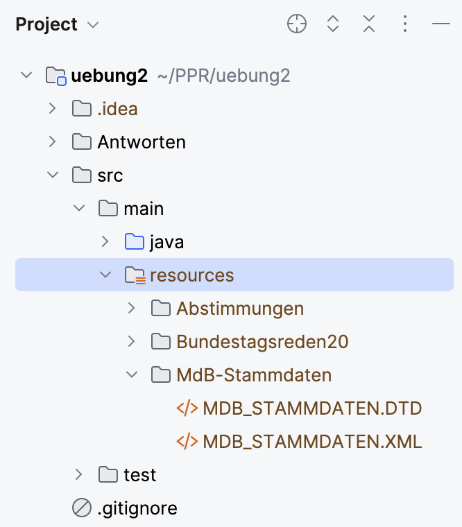

# Insight Bundestag
### Programmierpraktikum WiSe 2023/24 - Blatt 2
### Stud2


## Description
Das Programm erfasst die Stammdaten aller Abgeordneten des Deutschen Bundestags, deren Abstimmungsverhalten
sowie deren gehaltenen Bundestagsreden. Anschließend ist es möglich, einige interessante Suchanfragen
zu stellen. Dessen Ergebnisse werden dann in Textdateien gespeichert und anschließend auf der Konsole ausgegeben.

## Usage
### 1. Einpflegen der einzulesenden Dateien in das Projekt
Alle einzulesenden Dateien werden wie folgt in den Ordner ``src/main/resources`` eingepflegt:
- [ ] Die Dateien ```MDB_STAMMDATEN.DTD``` und ```MDB_STAMMDATEN.XML``` sind in den Ordner ```MdB-Stammdaten``` einzufügen.
- [ ] Die Dateien ```1.xml``` bis einschließlich ```131.xml``` mit den Bundestagssitzungen sowie die Datei ```dbtplenarprotokoll.dtd``` gehören
        in den Ordner ``Bundestagsreden20``.
- [ ] Die Excel-Dateien (``.xls`` und ``.xlsx``) mit den Abstimmungen sind in den Ordner ```Abstimmungen``` einzufügen.
 <br /> <br />

<br /> <br />
Falls man die Dateien anders als vorgesehen einpflegen möchte, so ist es notwendig, die entsprechenden
Dateipfad-Parameter bei *jedem Aufruf des Konstruktors von* ``BundestagFactoryImpl`` manuell zu ändern. Die Nutzung von relativen Pfaden könnte sich
als hilfreich erweisen, falls die im Projekt genutzten Pfade (stets Path from Content Root) nicht funktionieren sollten.

### 2.0 Suchanfragen stellen und Ergebnisse einsehen
Hat man das Programm in IntelliJ IDEA geöffnet und Schritt 1 erfolgreich ausgeführt, so können die einzelnen Abfragen über die Durchführung der jeweiligen Tests in
``src/test/java/org/texttechnologylab/project/Stud2/tests/AbfragenTests.java``  erfolgen. Die Ergebnisse werden 
dann im Ordner ``Antworten`` jeweils als Textdatei gespeichert und darüber hinaus auf der Konsole ausgegeben.

### 2.1 Liste vorgefertigter Suchanfragen (mit Annahmen zur Aufgabenstellung)
#### Abfrage (a)
- Eine Liste aller Abgeordneten - absteigend sortiert nach Häufigkeit insgesamt gehaltener Reden (primär) und durchschnittlicher Redelänge (sekundär).
Dabei können die Ergebnisse wahlweise nach Fraktion oder Partei gruppiert werden. <br /> <br />
*Annahme: In der Aufgabenstellung soll noch nach "sowie dem Fehlen dieser" gruppiert werden, also wenn der Abgeordnete
parteilos oder fraktionslos ist. Die Ergebnisse der Parteilosen werden in der Abfrage berücksichtigt, in der nach Partei gruppiert wird.
Analog für die Fraktionslosen.*
#### Abfrage (b)
- Eine Liste aller Ausschüsse im Bundestag mit jeweils allen erfassten Mitgliedern - absteigend 
sortiert nach Anzahl aller (jemals erfassten) Mitglieder.
#### Abfrage (c)
- Eine Liste aller Abgeordneten, die eine Mitgliedschaft in einem Ausschuss zu verzeichnen hatten - wahlweise 
geordnet nach Fraktion oder Wahlperiode. Alle Abgeordneten ohne Mitgliedschaften in einem Ausschuss sind jeweils ganz unten aufgelistet.
#### Abfrage (d)
- Eine Liste aller Abgeordneten - geordnet nach der Anzahl an Führungspositionen in Ausschüssen 
(d.h. als Obfrau, Obmann bzw. StellvertreterIn)
#### Abfrage (e)
- Eine Liste aller Abgeordneten mit ihren Abstimmungsergebnissen - geordnet nach Fraktion.
#### Abfrage (f)
- Eine Liste aller Abgeordneten und deren Fehltage - geordnet nach Fraktion (primär) und nach
Häufigkeit (sekundär). D.h. die Abgeordneten, die in einer Fraktion am meisten gefehlt haben, stehen in jeder Fraktion stets ganz oben. Abgeordnete ohne
erfasste Fehltage werden nicht aufgeführt.
#### Abfrage (g)
- Eine Liste aller Abgeordneten - absteigend sortiert nach Anzahl der Wahlperioden, in der der Abgeordnete ein Mandat hatte.<br /> <br />
  *Hinweis: Die Anzahl an Wahlperioden, in denen der Abgeordnete ein Mandat hatte, wird hier als Index für
  die Länge der Vertretung im Bundestag verwendet.*
#### Abfrage (h)
- Eine Liste aller Wahlkreise mit ihren dominierenden Parteien - nach Wahlperiode getrennt. Alternativ kann
statt dem Wahlkreis nach der Liste unterschieden werden.<br /> <br />
*Hinweis: Die Abfrage ergibt z.T. wenig Sinn, da in jedem Wahlkreis zu jeder Wahlperiode GENAU EIN DIREKTMANDAT existiert
  und die Partei des entsprechenden Abgeordneten den Wahlkreis zu 100% dominiert.*


#### Abfrage (i)
- Eine Liste aller Abgeordneten, die als Präsident, Vizepräsident oder Schriftführer aktiv sind/waren - geordnet nach Partei.

## Documentation
Im Projekt ist ein Ordner ``JavaDoc`` abgelegt worden. Öffne die darin enthaltene ``index.html`` im Browser, um Details zu den einzelnen Klassen und Methoden
des Projekts einzusehen.

## Project status
Entwicklung des Programms beendet. [Stand: 29.11.2023]