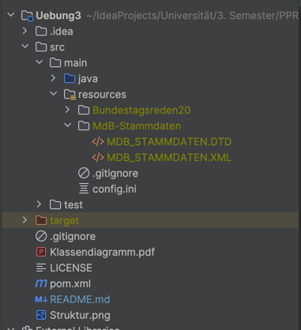

# PPR Übung 3

Dieses Projekt implementiert Übung 3 des PPR 2023/24.

## Aufgabe 1

Ein Use-Case-Diagramm sowie die Klassenstruktur des Projekts ist im UML-Diagramm in der Datei [UseCase-Klassendiagramm.png](UseCase-Klassendiagramm.png) zu finden.
Aufgrund der Größe des Diagramms lässt sich dieses nicht sinnvoll in die README.md selbst einbinden.

Die Klassen sind im Package `org.texttechnologylab.project.Stud1` implementiert.
Dabei sind die die öffentlichen Interfaces in `data` und die Implementierungen in `data.impl`.

Auch die `BundestagFactoryImpl` ist abgekapselt.
Sie kann nur durch `BundestagFactory::newInstance` erstellt werden.

Die `BundestagFactory` kann Dateien einlesen.
Dies geschieht über die Methoden `readStammdaten` und `readProtokoll`.
Diese nehmen jeweils eine Datei an.
Beim Einlesen bildet die `BundestagFactory` die Daten der Datei auf die entsprechenden Implementierungen ab und
speichert diese.
Über die definierten Methoden kann darauf dann zugegriffen werden.

### Dateien

Die Dateien sind im `src/main/resources`-Ordner im Projekt abzulegen.
Dort liegt bereits die `config.ini` für die Zugangsdaten.
Die Struktur des Projekts soll dann wie folgt aussehen (Inhalt des Bundestagsreden20-Ordner analog,
die Struktur entspricht der der Dateien in Olat):

### Tests

In `org.texttechnologylab.project.Stud1.Uebung3.tests.UploadTest` ist ein Unit-Tests implementiert,
der die Daten aus den Dateien einliest und in die Datenbank hochlädt.

### Dokumentation

Alle Klassen und Methoden sind mit JavaDoc dokumentiert.
Die Dokumentation kann mit IntelliJ generiert werden.

## Aufgabe 2

Die Abfragen sind wie in der Aufgabenstellung gefordert als Unit-Tests implementiert (wie viel Sinn das auch immer ergibt... naja).
Da die Konsole teilweise zu wenige Zeilen hat, werden zusätzlich zur Konsolenausgabe automatisch die Ergebnis-Dateien
erstellt.
Diese lassen sich im `Antworten`-Ordner im Projekt finden (dieser wird erstellt, wenn er noch nicht existiert).

Es wurden alle Abfragen (a)-(d) implementiert.
Daher ist keine Main-Klasse notwendig.
Die Unit-Tests von (a) und (b) sind parametrisiert.
Die Unit-Tests von (c) und (d) holen jeweils alle Daten, eine Parametrisierung ergibt hier keinen Sinn.
Teilaufgabe (e) wurde nicht implementiert.

Die Antworten lassen sich auch durch Ausführen der "Tests"
in `org.texttechnologylab.project.Stud1.Uebung3.tests` im `src/test`-Ordner generieren.
