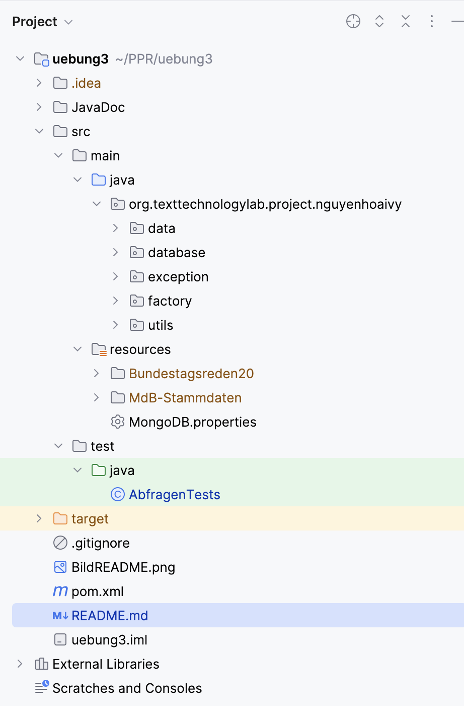

# Insight Bundestag
### Programmierpraktikum WiSe 2023/24 - Blatt 3
### Stud2


## Description
Das Programm erfasst die Stammdaten aller Abgeordneten des Deutschen Bundestags
sowie deren Reden und Kommentare. Anschließend ist es möglich, einige interessante Suchanfragen
zu stellen. Die jeweiligen Ergebnisse werden dann auf der Konsole ausgegeben.

## Usage
### 1. Einpflegen der einzulesenden Dateien in das Projekt
Die folgenden Dateien werden wie folgt in den Ordner ``src/main/resources`` eingepflegt:
- [ ] Die Dateien ```MDB_STAMMDATEN.DTD``` und ```MDB_STAMMDATEN.XML``` sind in den Ordner ```MdB-Stammdaten``` einzufügen.
- [ ] Die Dateien ```1.xml``` bis einschließlich ```131.xml``` mit den Bundestagssitzungen sowie die Datei ```dbtplenarprotokoll.dtd``` gehören
  in den Ordner ``Bundestagsreden20``.
- [ ] Die Datei ```MongoDB.properties``` mit den Zugangsdaten zur Datenbank (also die .txt aus dem OLAT zu MongoDB.properties umbenannt) gehört ebenfalls in den Resources-Ordner.
  <br /> <br />
  
  <br /> <br />
  Falls man die Dateien anders als vorgesehen einpflegen möchte, so ist es notwendig, die entsprechenden
  Dateipfad-Parameter bei *jedem Aufruf des Konstruktors von* ``BundestagFactory_Impl`` manuell zu ändern. Die Nutzung von relativen Pfaden könnte sich
  als hilfreich erweisen, falls die im Projekt genutzten Pfade (stets Path from Content Root) nicht funktionieren sollten.

### 2.0 Suchanfragen stellen
Hat man das Programm in IntelliJ IDEA geöffnet und Schritt 1 erfolgreich ausgeführt, so können die einzelnen Abfragen über die Durchführung der jeweiligen Tests in
``src/test/java/AbfragenTests`` erfolgen. Die Ergebnisse werden dann auf der Konsole ausgegeben. <br />

#### Hinweis: Das Einlesen der Kommentare nimmt mit Abstand am meisten Zeit ein.

### 2.1 Liste der Suchanfragen
Jede der Abfragen kann parametrisiert nach Fraktion/Partei, Datum oder Zeitraum gefiltert werden. Näheres zu den Testfunktionen im JavaDoc.
#### Abfrage (a)
- Eine Liste aller Abgeordneten - absteigend sortiert nach Häufigkeit gehaltener Reden. <br />

#### Abfrage (b)
- Eine Liste aller Redebeiträge - absteigend sortiert nach Anzahl des Vorkommens des Wortes "Ukraine", "Russland" bzw. "Ampel".

#### Abfrage (c)
- Eine Liste aller Redner - absteigend sortiert nach durchschnittlicher Länge aller Redebeiträge. Dabei wird die Anzahl der Worte als Maß genommen.
- Annahme: In der Aufgabenstellung ist noch von Parteien und Fraktionen die Rede - diese werden als Filterargumente interpretiert.

#### Abfrage (d)
- Eine Liste aller Sitzungen - absteigend sortiert nach deren Dauer. <br />

#### Hinweis: Bei einigen Tests wurden bei den Datums/Zeitraumfiltern nur vereinzelte Parteien/Fraktionen und Daten/Zeiträume zum Testen ausgewählt - eine Testung von allen möglichen Kombinationen wäre hirnlos. <br /> <br /> Falls man eigene Parameter eingeben möchte, ist das für den Nutzer unter Beachtung der JavaDoc natürlich jederzeit möglich. 
## Documentation
Im Projekt ist ein Ordner ``JavaDoc`` abgelegt worden. Öffne die darin enthaltene ``index.html`` im Browser, um Details zu den einzelnen Klassen und Methoden
des Projekts einzusehen.

## Project status
Entwicklung des Programms beendet. [Stand: 21.12.2023]
