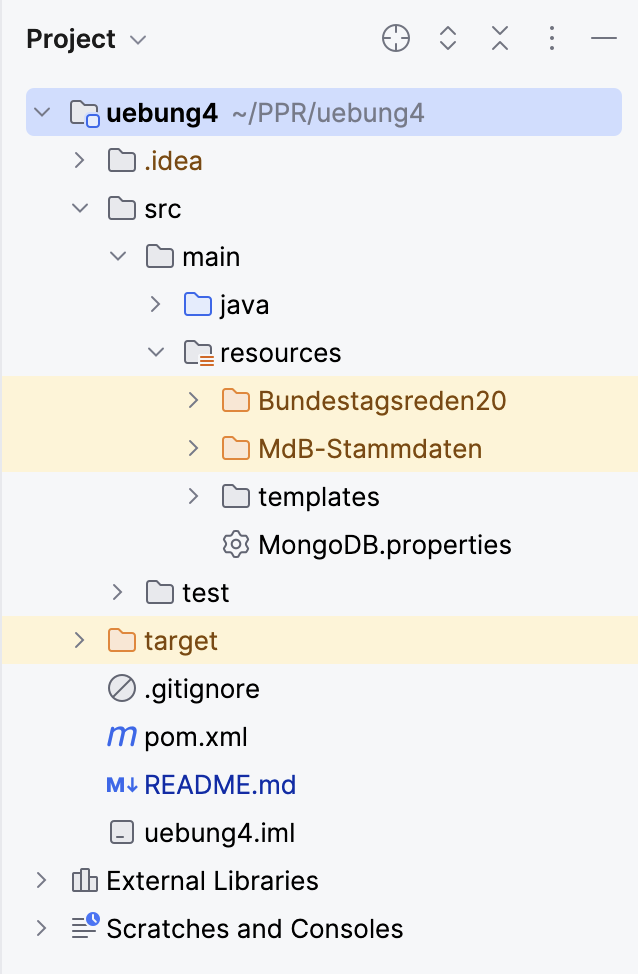

# Insight Bundestag
### Programmierpraktikum WiSe 2023/24 - Blatt 4
### Stud2


## Description
Das Programm erfasst die Stammdaten aller Abgeordneten des Deutschen Bundestags
sowie deren Reden, die in der 20. Wahlperiode gehalten wurden. Diese Reden können dann mittels des Docker Unified UIMA Interfaces
analysiert und in einer webbasierten Form dargestellt werden.

## Usage
### 1.1 XML-Dateien einpflegen 
#### (optional, wenn man die Daten nicht erneut nicht einlesen möchte)
Die folgenden Dateien werden wie folgt in den Ordner ``src/main/resources`` eingepflegt:
- [ ] Die Dateien ```MDB_STAMMDATEN.DTD``` und ```MDB_STAMMDATEN.XML``` sind in den Ordner ```MdB-Stammdaten``` einzufügen.
- [ ] Die Dateien ```1.xml``` bis einschließlich ```131.xml``` mit den Bundestagssitzungen sowie die Datei ```dbtplenarprotokoll.dtd``` gehören
  in den Ordner ``Bundestagsreden20``.
  <br /> <br />
  
  <br /> <br />
  Falls man die Dateien anders als vorgesehen einpflegen möchte, so ist es notwendig, die entsprechenden
  Dateipfad-Parameter bei *jedem Aufruf des Konstruktors von* ``BundestagFactory_Impl`` manuell zu ändern. Die Nutzung von relativen Pfaden könnte sich
  als hilfreich erweisen, falls die im Projekt genutzten Pfade (stets Path from Content Root) nicht funktionieren sollten.

### 1.2 Docker-Images herunterladen
Die folgenden beiden Docker-Images müssen mit dem Befehl ```docker pull``` über das Terminal heruntergeladen werden:
- [ ] ```docker.texttechnologylab.org/textimager-duui-spacy-single-de_core_news_sm:0.1.6```
- [ ] ```docker.texttechnologylab.org/gervader_duui:1.0.2```

### 2. Programm starten
Das Programm wird über die Main-Funktion gestartet. Beachte die Anweisungen auf der Konsole! Sobald die MongoDBImpl-Objekte initialisiert wurden, wird der Link für die Startseite 
auf der Konsole ausgegeben (http://localhost:1234/InsightBundestag/startseite). Während der Nutzung der Webseite werden die Log-Einträge auch auf der Konsole ausgegeben.

## Documentation
Im Projekt ist ein Ordner ```JavaDoc```abgelegt worden. Öffne die darin enthaltene Datei ```index.html``` im Browser, um die Dokumentation des Quellcodes einzusehen.

## Project status
Entwicklung des Programms beendet. [Stand: 28.01.2024]
